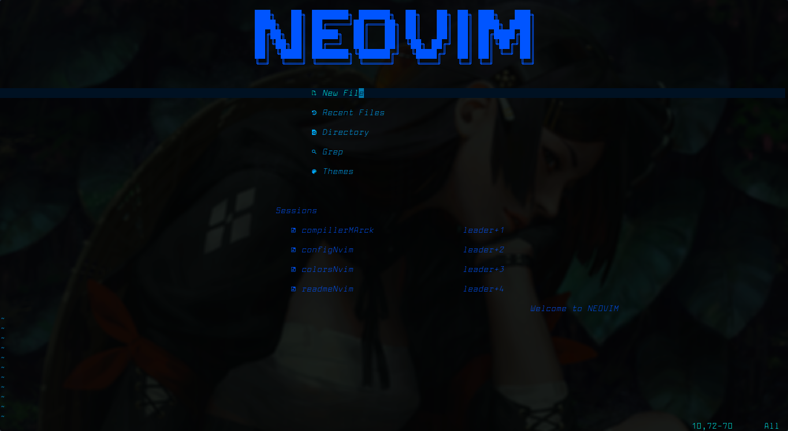
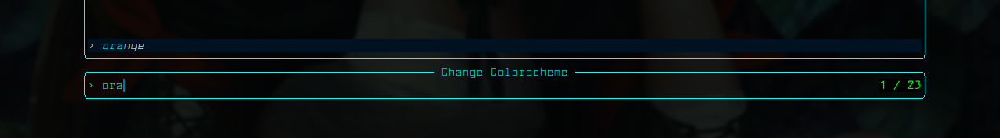
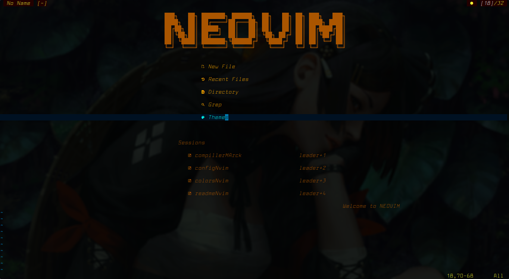
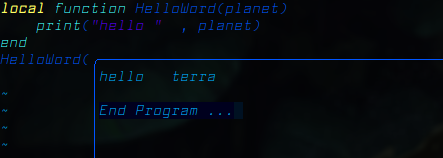
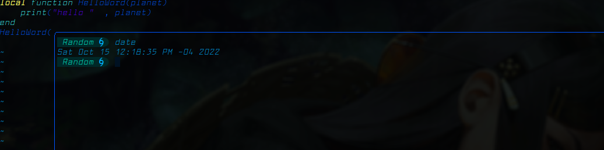
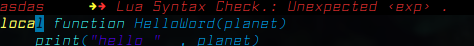

## NVIM 

## captura de pantallas :

| startup | 
| ---   | 
|  | 
| temas |
|  | 
|  |

| Run | terminal |
| --- | --- |
|   |  |


| Lsp | Cmp |
| --- | --- |
|   |  |


### caracteristicas :
* minimalista
* configuracion de temas facil
* atajos de teclado simples 
* compilar y correr varios lenguajes
* cmp para el auto completado
* lsp para el dignostico
* terminal flotante
* documentacion para crear vim scripts
* Telescope :
    * file explorer
    * file grep
    * file history

### Instalar :
```sh
    cd ~/.config/
    git clone git_repo
```


### Requerimientos neovim :

* Plug  `https://github.com/junegunn/vim-plug ` 

```sh
sh -c 'curl -fLo "${XDG_DATA_HOME:-$HOME/.local/share}"/nvim/site/autoload/plug.vim --create-dirs \ 
https://raw.githubusercontent.com/junegunn/vim-plug/master/plug.vim'
```

* Packer  `https://github.com/wbthomason/packer.nvim `
```sh
git clone --depth 1 https://github.com/wbthomason/packer.nvim \
~/.local/share/nvim/site/pack/packer/start/packer.nvim
```

* latex to pdf
```sh
sudo pacman -S textlive-most
```
* Marckdown to pdf
```sh
sudo pacman -S pandoc
```

* View pdf
```sh
sudo pacman -S zathura
```
#### Lsp : `https://github.com/neovim/nvim-lspconfig`
* install:
```sh
# para arch linux :

#denols:( typescript )
    sudo pacman -S deno
# rust_analyzer
   sudo pacman -S rust-analyzer  
#texllab 
#https://github.com/latex-lsp/texlab
    sudo pacman -S texlab
    #or
    cargo install texlab

# pyright: python  
    sudo pacman -S pyright

# sumneko_lua :  lua 
    sudo pacman -S lua-language-server
# para nmp :

# jsonls , html 
    sudo npm i -g vscode-langservers-extracted

# vimls 
    sudo npm install -g vim-language-server

# bashls 
    sudo npm i -g bash-language-server
```

#### iniciar nvim :

* habilite el modo comando en nvim y :

``` 
    : PlugInstall
    : PackerInstall
```        

### HELP ?

```
    ver .Docs/
```

